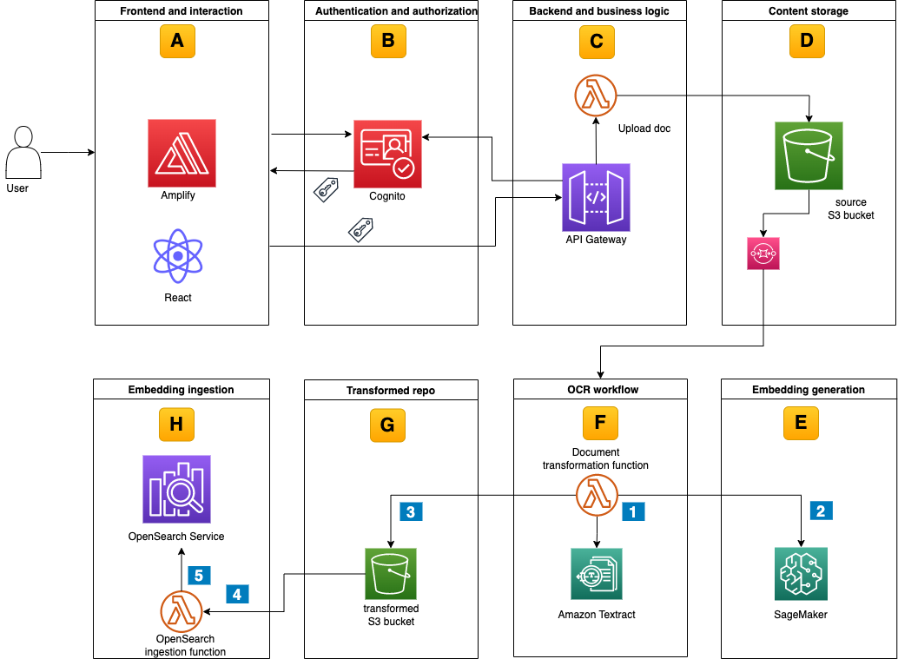

# Content Repository With Dynamic Access Control And Multilingual Semantic Search

This example walks you through how to build an end-to-end content repository using AWS services. It features multilingual semantic search capabilities while maintaining a simple and dynamic access control based logic over unstructured data. This sample includes an AWS Cloud Development Kit (CDK) application to deploy the building blocks as depicted in the diagram below. A simple react web UI to upload and search documents completes this demo environment. Further details can be found in this related [AWS architecture blog post](https://aws.amazon.com/blogs/architecture/content-repository-for-unstructured-data-with-multilingual-semantic-search-part-2). The code is not meant for production workloads.




<!--BEGIN STABILITY BANNER-->
---


> This is a stable example. It should successfully build out of the box.
>
> This prototype is built on CDK construct libraries marked "stable" with the exception of [amplify_alpha](https://docs.aws.amazon.com/cdk/api/v2/docs/aws-amplify-alpha-readme.html) but thoroughly tested.
<!--END STABILITY BANNER-->

## Prerequisites

You should have the following prerequisites to deploy the content repository with demo data:
* An AWS account or sign up to [create and activate one](https://aws.amazon.com/premiumsupport/knowledge-center/create-and-activate-aws-account/).
* The following software installed on your development machine, or use an [AWS Cloud9](https://aws.amazon.com/cloud9/) environment:
    * Install the [AWS Command Line Interface](https://aws.amazon.com/cli/) and [configure it to point to your AWS account](https://docs.aws.amazon.com/cli/latest/userguide/cli-chap-configure.html).
    * Install [TypeScript](https://www.typescriptlang.org/download) and use a package manager such as [npm](https://docs.npmjs.com/downloading-and-installing-packages-locally).
    * Install the [AWS CDK](https://docs.aws.amazon.com/cdk/latest/guide/getting_started.html).
    * Docker installed and running.
 * Ensure that you have appropriate [AWS credentials](https://docs.aws.amazon.com/cli/latest/userguide/cli-configure-files.html) for interacting with resources in your AWS account.

## Deployment

The following steps will deploy two AWS CDK stacks into your AWS account:
* content-repo-search-stack (blog-content-repo-search-stack.ts) creates the environment detailed in the figure above except for the SageMaker endpoint which you create in a separate step. 
* demo-data-stack (userpool-demo-data-stack.ts) deploys sample users, groups, and role mappings.

Clone the project git repository:
```bash
git clone https://github.com/aws-samples/content-repository-with-multilingual-search 
```

Install the necessary dependencies:
```bash
cd content-repository/backend-cdk
npm install
```

Configure environment variables::
```bash
export CDK_DEFAULT_ACCOUNT=$(aws sts get-caller-identity --query 'Account' --output text)
export CDK_DEFAULT_REGION=$(aws configure get region)
```

Bootstrap your account for AWS CDK usage:
```bash
cdk bootstrap aws://$CDK_DEFAULT_ACCOUNT/$CDK_DEFAULT_REGION
```

Deploy the code to your AWS account while Docker is running:
```bash
cdk deploy --all
```

The complete stack set-up might take up-to 25 minutes. 

Follow below steps to create the SageMaker endpoint:
1. Open the SageMaker console at [https://console.aws.amazon.com/sagemaker/](https://console.aws.amazon.com/sagemaker/)
2. Choose **Notebook** instances, then choose **Create notebook instance**.
3. Under the **Notebook instance settings**, provide a name “content-repo-notebook” to the notebook and leave other defaults as-is.
4. Under the **Permissions and encryption** section, you would see an IAM role with the prefix content-repo-stack. Leave the rest of the defaults and click on **Create notebook instance**.
5. You will see that notebook creation will go to *pending* status before its available for use within few minutes.
6.Once the notebook is in the available status, click on the **Open Jupyter** action.
7. Click on the **Upload** button on the right to upload the `create-sagemaker-endpoint.ipynb` file in the `backend-cdk` folder of the root of the blog repository.
8. Open the `create-sagemaker-endpoint.ipynb` notebook and then select the option **Run All** from the **Cell** section to execute all the cells. This might take up-to 10 minutes.
9. Once all the cells have been successfully executed, verify that the SSM parameter `sagemaker-endpoint` is updated with the value of the SageMaker endpoint name.
10. Verify that you see deployed Inference endpoint under **Endpoints** in the SageMaker section of the AWS Console.
11. Upload sample data to the content repository:
    * Please note that before you execute the script you need to update the `S3_BUCKET_NAME` with the `s3SourceBucketName` from the AWS CDK output of the content-repo-stack. 
    * Execute `upload_documents_to_S3.sh` script in the root folder of the blog repository to upload the sample review data set. This takes a couple of minutes. 

## Using the search service

The diagram below describes the lifecycle of a user-initiated search request.


1. Access the front-end application
    * Copy the `amplifyHostedAppUrl` value shown in the AWS CDK output from the content-repo-stack.
    * Use the URL with your web browser to access the frontend application.
    * A temporary page displays until the automated build and deployment of the React application completes after 4-5 minutes.
2. Application sign-in
    * The react webpage asks you to sign in first, then change the temporary password.
    * The content repository provides two demo users with credentials as part of the demo-data-stack in the AWS CDK output. Start with the `sales-user` user, which belongs to the `sales` department.
3. Enter the search query and verify results. For example
    * Enter “*works well*” as the search query. Note the multi lingual output and the semantically similar results
    * Check the result for the search query “*bad quality*"
4. You can re-log in using the `marketing-user` and credentials to verify access control.
    * This time with “*works well*” you find different output as the `sales-user` thanks to access control that allows `marketing-user` to search only for the documents that belong to the `marketing` department. 

### Outlook
The building blocks of the semantic search for unstructured documents namely Amazon Textract, Amazon SageMaker and Amazon OpenSearch services set a solid foundation for you to customize and enhance the search capabilities as per your specific use-case. For example, you can leverage the fast developments in Large Language Models (LLM) to enhance the semantic search experience by replacing the encoder model with an LLM capable of generating multilingual embedding while still maintaining the OpenSearch service to store and index data and perform vector search. 

## Cleaning up

In the subdirectory “backend-cdk”, delete the deployed resources:
```
cdk destroy –all 
```
Additionally delete the SageMaker endpoint/notebook instance.

## Useful commands
 * `cdk ls`          list all stacks in the app
 * `cdk synth`       emits the synthesized CloudFormation template
 * `cdk deploy`      deploy this stack to your default AWS account/region
 * `cdk diff`        compare deployed stack with current state
 * `cdk docs`        open CDK documentation

Enjoy!

## Security

See [CONTRIBUTING](CONTRIBUTING.md#security-issue-notifications) for more information.

## License

This library is licensed under the MIT-0 License. See the LICENSE file.