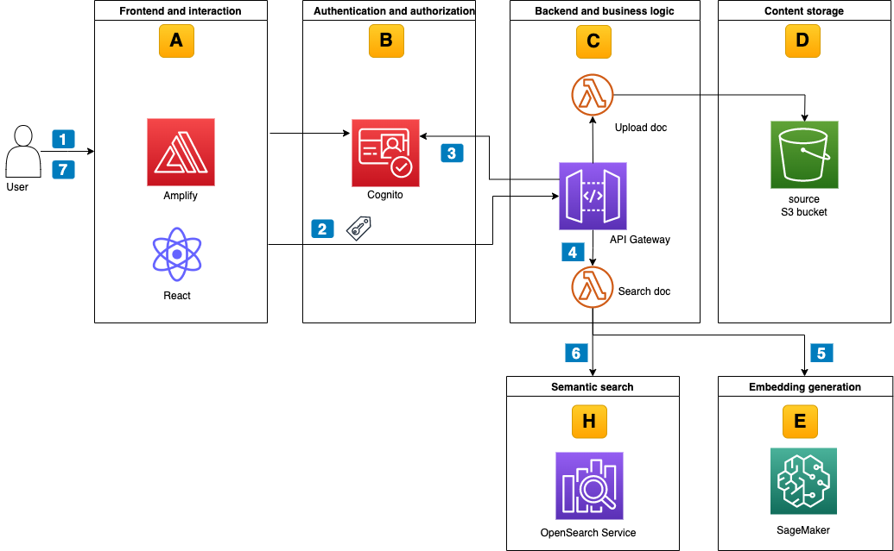

# Content Repository With Dynamic Access Control And Multilingual Semantic Search

This example walks you through how to build an end-to-end content repository using AWS services. It features multilingual semantic search capabilities while maintaining a simple and dynamic access control based logic over unstructured data. This sample includes an AWS Cloud Development Kit (CDK) application to deploy the building blocks as depicted in the diagram below. A simple react web UI to upload and search documents completes this demo environment. Further details can be found in this related [AWS architecture blog post](https://aws.amazon.com/blogs/architecture/content-repository-for-unstructured-data-with-multilingual-semantic-search-part-2). The code is not meant for production workloads.


<!--BEGIN STABILITY BANNER-->
---


> This is a stable example. It should successfully build out of the box.
>
> This prototype is built on CDK construct libraries marked "stable" with the exception of [amplify_alpha](https://docs.aws.amazon.com/cdk/api/v2/docs/aws-amplify-alpha-readme.html) but thoroughly tested.
<!--END STABILITY BANNER-->

## Prerequisites

You should have the following prerequisites to deploy the content repository with demo data:
* An AWS account or sign up to [create and activate one](https://aws.amazon.com/premiumsupport/knowledge-center/create-and-activate-aws-account/).
* The following software installed on your development machine, or use an [AWS Cloud9](https://aws.amazon.com/cloud9/) environment:
    * Install the [AWS Command Line Interface](https://aws.amazon.com/cli/) and [configure it to point to your AWS account](https://docs.aws.amazon.com/cli/latest/userguide/cli-chap-configure.html).
    * Install [TypeScript](https://www.typescriptlang.org/download) and use a package manager such as [npm](https://docs.npmjs.com/downloading-and-installing-packages-locally).
    * Install the [AWS CDK](https://docs.aws.amazon.com/cdk/latest/guide/getting_started.html).
    * Docker installed and running.
 * Ensure that you have appropriate [AWS credentials](https://docs.aws.amazon.com/cli/latest/userguide/cli-configure-files.html) for interacting with resources in your AWS account.

## Deployment

The following steps will deploy two AWS CDK stacks into your AWS account:
* [content-repo-search-stack](/backend-cdk/lib/blog-content-repo-search-stack.ts) creates the environment detailed in the figure above except for the SageMaker endpoint which you create in a [separate step](#creation-of-sagemaker-endpoint).
* [demo-data-stack](/backend-cdk/lib/userpool-demo-data-stack.ts) deploys sample users, groups, and role mappings.

Clone the project git repository:
```bash
git clone https://github.com/aws-samples/content-repository-with-multilingual-search content-repository
```

Install the necessary dependencies:
```bash
cd content-repository/backend-cdk
npm install
```

Configure environment variables::
```bash
export CDK_DEFAULT_ACCOUNT=$(aws sts get-caller-identity --query 'Account' --output text)
export CDK_DEFAULT_REGION=$(aws configure get region)
```

Bootstrap your account for AWS CDK usage:
```bash
cdk bootstrap aws://$CDK_DEFAULT_ACCOUNT/$CDK_DEFAULT_REGION
```

Deploy the code to your AWS account while Docker is running:
```bash
cdk deploy --all
```

The complete stack set-up might take up-to 25 minutes. 

### Creation of SageMaker endpoint
Follow below steps to create the SageMaker endpoint in the same AWS Region where you deployed the AWS CDK stack:
1. Sign in to the [SageMaker console](https://console.aws.amazon.com/sagemaker/).
2. In the navigation menu, select **Notebook**, then **Notebook instances**.
3. Choose **Create notebook instance**.
4. Under the **Notebook instance settings**, enter `content-repo-notebook` as the notebook instance name, and leave other defaults as-is. .
5. Under the **Permissions and encryption** section, you need to set the IAM role section to the role with the prefix `content-repo-search-stack`. In case you don’t see this role automatically populated, select it from the drop-down. Leave the rest of the defaults, and choose **Create notebook instance**.
6. The notebook creation status changes to *Pending* before it’s available for use within 3-4 minutes.
7. Once the notebook is in the *Available* status, choose **Open Jupyter**.
8. Choose the **Upload** button and upload the `create-sagemaker-endpoint.ipynb` file in the `backend-cdk` folder of the root of the blog repository.
9. Open the `create-sagemaker-endpoint.ipynb` notebook. Select the option **Run All** from the **Cell** menu. This might take up to 10 minutes. 
10. After all the cells have successfully run, verify that [AWS Systems Manager](https://aws.amazon.com/systems-manager/) parameter `sagemaker-endpoint` is updated with the value of the SageMaker endpoint name. You see this value as the output of the cell as shown below. In case you don’t see the output check if the preceding steps were run correctly. 
11. Verify in the SageMaker console that the inference endpoint with the prefix `tensorflow-inference` has been deployed and is set to status `InService`.
12. Upload sample data to the content repository:
    * Update the `S3_BUCKET_NAME` variable in the `upload_documents_to_S3.sh` script in the root folder of the blog repository with the `s3SourceBucketName` from the AWS CDK output of the `content-repo-search-stack`. 
    * Run `upload_documents_to_S3.sh` script to upload 160 sample documents to the content repository. This takes 5-6 minutes. 

## Using the search service

At this stage you have deployed all the building blocks for the content repository in your AWS account. You also pushed a limited corpus of 160 sample documents (.png format) to the content repository. Each document is in one of the four different languages - English, German, Spanish and French. With the added multilingual search capability, you can query in one language and receive semantically similar results across different languages while maintaining the access control logic. The diagram below describes the lifecycle of a user-initiated search request.


1. Access the front-end application:
    * Copy the `amplifyHostedAppUrl` value of the AWS CDK output from the **content-repo-search-stack** shown in the terminal.
    * Enter the URL in your web browser to access the frontend application.
    * A temporary page displays until the automated build and deployment of the React application completes after 4-5 minutes.
2. Sign in to the application:
    * The content repository provides two demo users with credentials as part of the **demo-data-stack** in the AWS CDK output. Copy the password from the terminal associated with the `sales-user`, which belongs to the `sales` department.
    * Follow the prompts from the React webpage to sign in with the `sales-user` and change the temporary password.
3. Enter search queries and verify results. For example:
    * Enter `works well` as the search query. Note the multilingual output and the semantically similar results.
    * Enter `bad quality` as the search query. Note the multilingual output and the semantically similar results. 
4. Sign out as the `sales-user` with the **Log Out** button on the webpage.
4. Sign in using the `marketing-user` credentials to verify access control.
    * Follow the sign in procedure in step 2 but with the `marketing-user`.
    * This time with `works well` as search query, you find different output. This is because the access control only allows `marketing-user` to search for the documents that belong to the `marketing` department. 

### Outlook
The building blocks of the semantic search for unstructured documents—Amazon Textract, Amazon SageMaker, and Amazon OpenSearch Service—set a foundation for you to customize and enhance the search capabilities for your specific use case. For example, you can leverage the fast developments in [Large Language Models (LLM) to enhance the semantic search experience](https://docs.aws.amazon.com/solutions/latest/qnabot-on-aws/semantic-question-matching.html). You can replace the encoder model with an LLM capable of generating multilingual embeddings while still maintaining the OpenSearch service to store and index data and perform vector search. 

## Cleaning up

In the `backend-cdk` subdirectory of the cloned repository, delete the deployed resources:
```
cdk destroy –all 
```
Additionally, you need to access the Amazon SageMaker console to [delete the SageMaker endpoint and notebook instance](https://docs.aws.amazon.com/sagemaker/latest/dg/ex1-cleanup.html).

## Useful commands
 * `cdk ls`          list all stacks in the app
 * `cdk synth`       emits the synthesized CloudFormation template
 * `cdk deploy`      deploy this stack to your default AWS account/region
 * `cdk diff`        compare deployed stack with current state
 * `cdk docs`        open CDK documentation

Enjoy!

## Security

See [CONTRIBUTING](CONTRIBUTING.md#security-issue-notifications) for more information.

## License

This library is licensed under the MIT-0 License. See the LICENSE file.